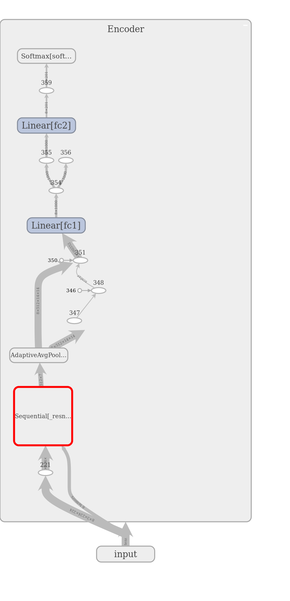

## Birds-Species-Classifications-using-Transfer-Learning


Classify an object from input an image and labelled them is a challenging task in the field of computer vision.
Transfer learning help us to classify the object by using pretrained cnn model (Trained on Imagenet dataset). In this project, I wrote a model which can classify Birds species by leveraging pretrained cnn model with extra layer.

 
This is an open source project. The project is under construction,

### Requirements
- Python 3.5 or later
- Install Pytorch 1.0 or later (https://pytorch.org/)
- Install tqdm   (pip install tqdm)

## The architecture of the model is illustrated by the following


### Data
To use your own dataset, you must create a CSV file using the following format:
```
/path/to/images1, class_number1
/path/to/images1, class_number1
...
```
- training file name: train_corpus.csv

- validation file name: valid_corpus.csv
